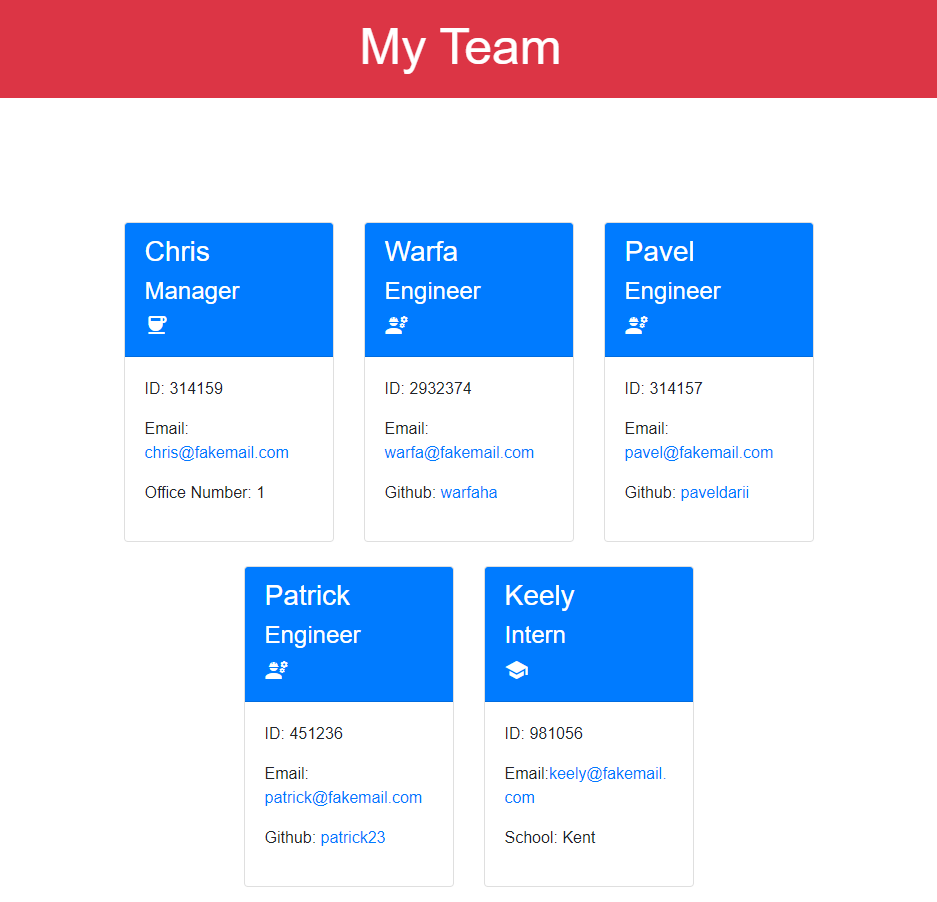

# My-Team-Profile-Generator

Using a Node.js command-line application that takes in information about employees and generates an HTML webpage that displays summaries for each person.

## Table of Contents
* [Description](#description)
* [Installation](#installation)
* [Usage](#usage)
* [Contribution](#contribution)
* [Tests](#test)
* [Licenses](#licenses)
* [Contact](#contact)
* [Credits](#credits)

## Description
GIVEN a command-line application that accepts user input
WHEN a manager is prompted for their team members and their information
THEN an HTML file is generated that displays a nicely formatted team roster based on user input

## Installation
I would install this project using node js and inquirer packages and Jest to run tests

## Usage
You would use this generator to save time building a team profile by answering a few user input questions from the command line

## Contribution
They can create pull requests and request to become contributers to this project

## Tests
I will include a gif on how this project works, but you you can test it via the command line by running "npm test" to run Jest and see if the tests pass or fail. 

![GIF-of-tests]
![GIF-of-userinput]

## Licenses
To view the MIT license. Click the license button above.

## Contact
If you have any additional questions, here's how to reach me.

GitHub: https://github.com/WarfaHa  
Email: Warfa60@gmail.com

## Credits
This Team Profile was created by Warfa Hassan
